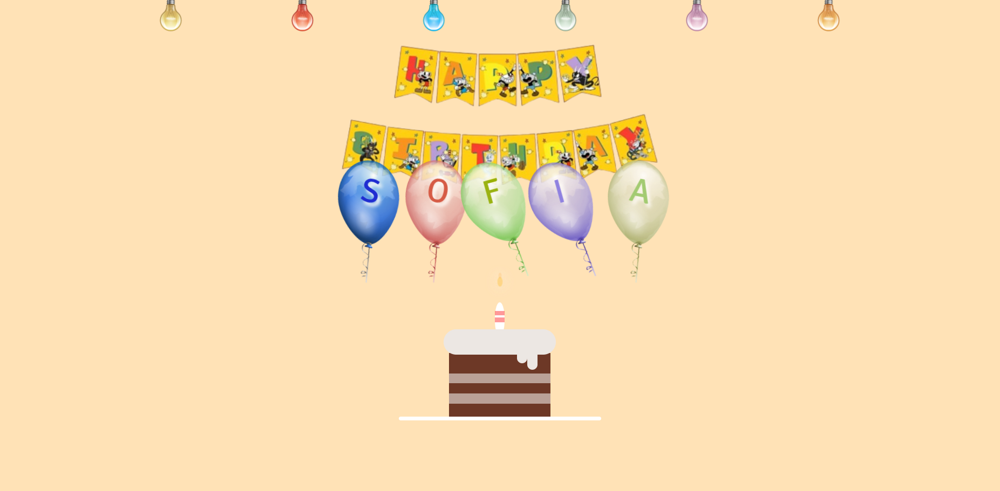

# 🎉 Happy Birthday Sofi! 🎂

Este repositorio contiene el código de una página web especial con temática de Cuphead creada para celebrar el cumpleaños de Sofi. 🌟

## Descripción

Esta página de cumpleaños incluye una animación inicial temática de programación, con un mensaje especial escrito en estilo pixelado que dice `print("Bienvenida Chsita")`. Al hacer clic en "Encender las luces", la animación desaparece y la página se ilumina con coloridos globos, una torta de cumpleaños y un mensaje conmovedor.

## Captura de Pantalla



## Estructura del Proyecto

El proyecto incluye los siguientes archivos y carpetas:

- `index.html`: El archivo principal que contiene la estructura HTML de la página.
- `stylesheet.css`: Hoja de estilos para dar formato y diseño a la página.
- `loading.css`: Estilos específicos para la animación de carga.
- `effect.js`: Script de JavaScript para manejar las interacciones y efectos de la página.
- `cake.less`: Archivo LESS para los estilos específicos de la torta.
- `hbd.mp3`: Archivo de audio para la canción de cumpleaños.
- `banner.png`: Imagen del banner de cumpleaños.
- `Balloon-Border.png`: Imagen de la frontera de globos.
- `screenshot.png`: Captura de pantalla de la página.

## Cómo Usar

1. Clona este repositorio en tu máquina local:
   ```bash
   git clone https://github.com/JosephAntony37900/happy-birthday-sofi.git
